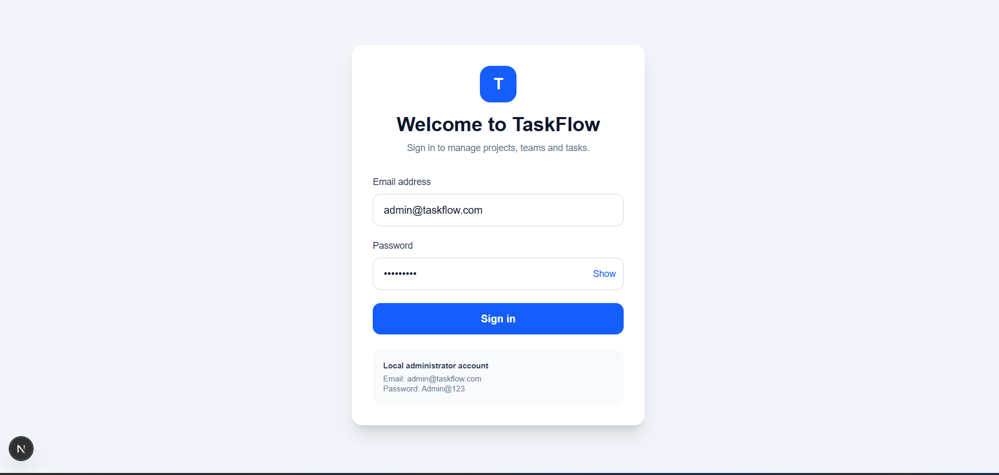
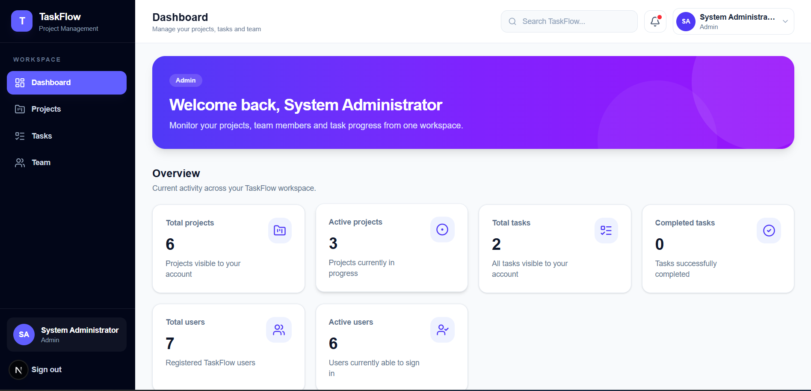
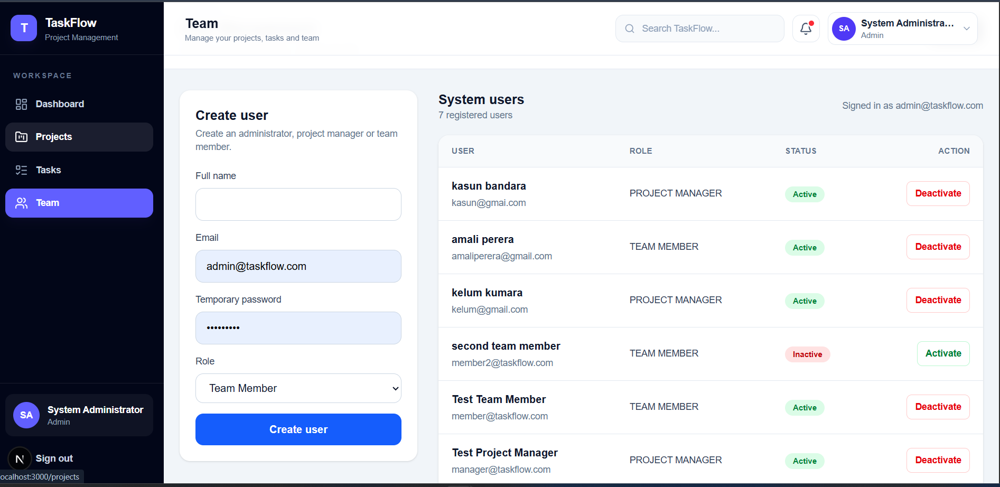
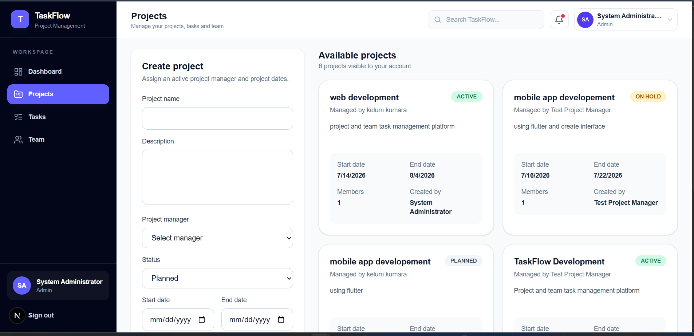
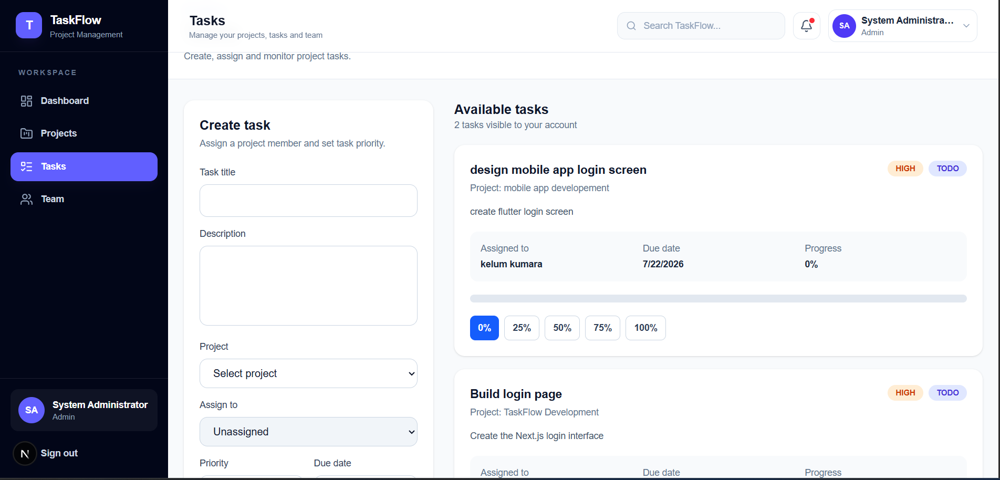

# TaskFlow - Project Management System

## Overview

TaskFlow is a full-stack Project Management System developed using Next.js, Express.js, Prisma and MySQL.

The system supports three user roles:

- Administrator
- Project Manager
- Team Member

---

## Features

### Authentication

- JWT Login
- Role-based Authentication

### Dashboard

- Project statistics
- Task statistics
- Progress overview

### User Management

- Create users
- Activate / Deactivate users
- Assign roles

### Project Management

- Create projects
- Assign project managers
- Manage project status

### Task Management

- Create tasks
- Assign team members
- Update task progress

---

## Technology Stack

### Frontend

- Next.js
- React
- TypeScript
- Tailwind CSS

### Backend

- Express.js
- TypeScript
- Prisma ORM
- JWT Authentication

### Database

- MySQL

---

## Folder Structure

```
taskflow
│
├── client
├── server
├── screenshots
└── README.md
```

---

## Installation

### Backend

```bash
cd server
npm install
npm run dev
```

### Frontend

```bash
cd client
npm install
npm run dev
```

---

## Environment Variables

### Client

Create:

```
client/.env.local
```

```env
NEXT_PUBLIC_API_URL=http://localhost:5000/api/v1
```

### Server

Create:

```
server/.env
```

```env
DATABASE_URL=your_database_url
JWT_SECRET=your_secret_key
PORT=5000
```

---

## Screenshots


### Login



### Dashboard



### Users



### Projects



### Tasks



---

## Author

**Samindhya Jayasinghe**